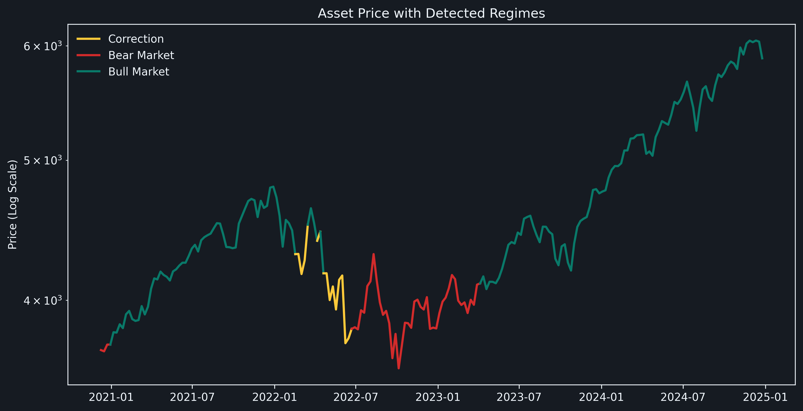
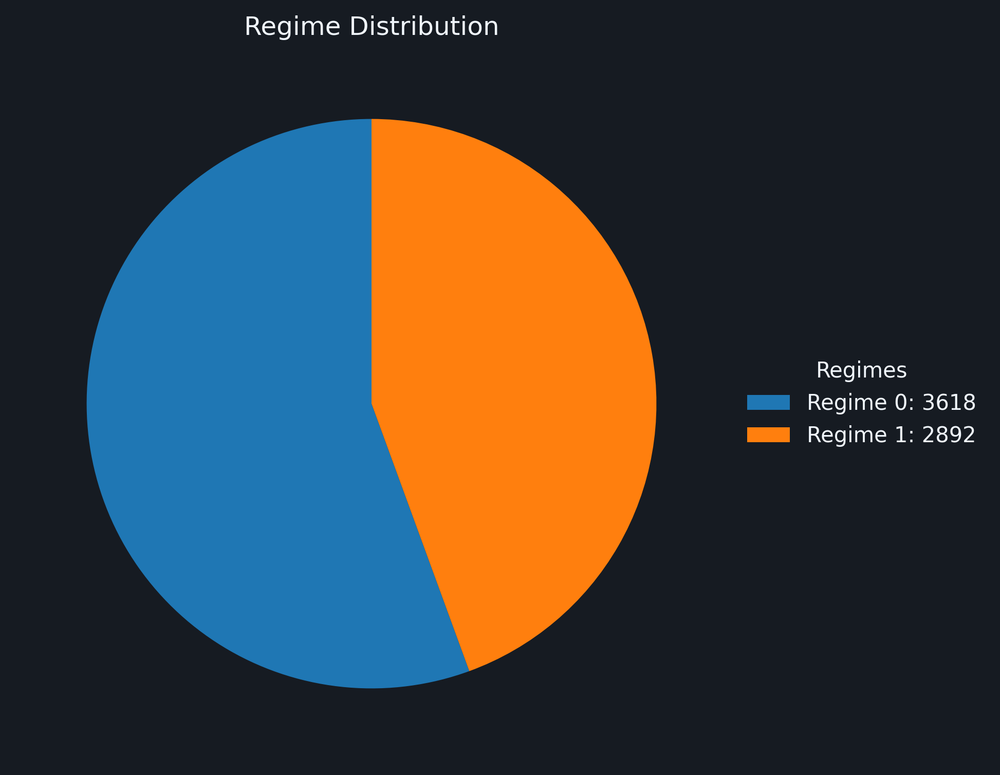

# Market Regime Detection

## Showcase

Placeholders for generated images:




## Description

This project detects market regimes using a simple rule-based approach with the 50-week Simple Moving Average (SMA) on SPX:

### Regime Classification Rules:
- **Bull Market** (Green): Price is above the 50-week SMA
- **Correction** (Yellow): Price breaks below the 50-week SMA but stays below for less than 10 consecutive weeks
- **Bear Market** (Red): Price is below the 50-week SMA for 10 or more consecutive weeks
  - **Bear Market Exit**: Requires 4 consecutive weekly closes above the 50W SMA to confirm trend change back to bull market

This approach provides clear, objective regime identification without complex modeling. The chart uses a logarithmic scale for better visualization across long time periods. Yellow corrections help visualize temporary weakness during bull markets, while the 10-week threshold ensures only sustained weakness is classified as a bear market. The 4-week confirmation requirement for exiting bear markets prevents false signals from temporary bounces.

## Usage

Install requirements:

```
pip install -r requirements.txt
```

Run the CLI (defaults shown):

```
python main.py --start 1946-05-21 --end today --ticker ^GSPC
```

By default, the analysis runs from May 21, 1946 (S&P 500 inception) to today.

For help:

```
python main.py --help
```

## Files

- `main.py`: CLI entry point with argument parsing.
- `src/data_loader.py`: Downloads weekly SPX data from yfinance, computes 50W SMA, and applies regime classification rules with state machine logic for bear market exits.
- `src/plotting.py`: Creates regime-colored line charts (logarithmic scale) and percentage-based distribution pie charts using matplotlib + matplotx.

## Output

- `plots/regime_plot.png`: Price chart with regime-colored line segments (log scale)
- `plots/regime_distribution.png`: Pie chart showing time spent in each regime (as percentages)

## License

This project is licensed under the Creative Commons Attribution-NonCommercial 4.0 International (CC BY-NC 4.0).

Full license: https://creativecommons.org/licenses/by-nc/4.0/

## Author

Lucas Caetano
